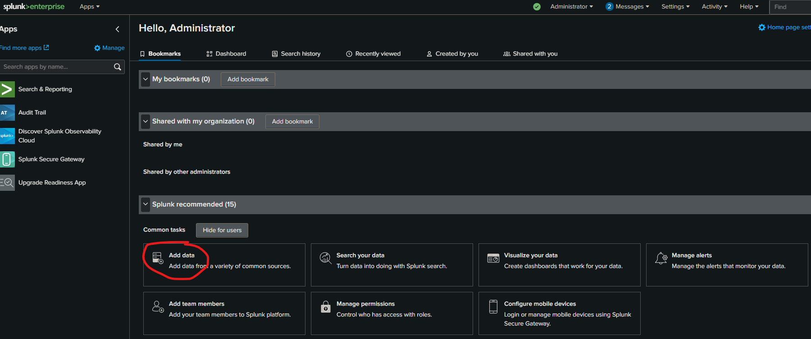

## Experience

- Installed and set up Splunk Enterprise, import the provided dataset and explore it using Splunk.
- Gained hands-on experience in data analysis, especially in the context of cyber data.
- Understood the importance of data visualization in uncovering trends and patterns.
- Learnt to use Splunk, a Cyber data/ SEIM analysis tool, for creating dashboards and visual representations of data.
- Developed skills in interpreting data fields and identifying key insights.
- Created a comprehensive dashboard with charts and tables to visualize fraud-related data for submission.

# Task 1
## Here is the background information on your task

As a cyber security generalist at Commonwealth Bank, it is important to be aware of the increasing rate and complexity of financial fraud and the need for effective defence solutions. Financial fraud poses a significant challenge for financial institutions, and it is important for Commonwealth Bank to stay up to date with the latest fraud detection technologies and strategies to minimize risk. Protecting against and responding to fraud is a major responsibility for you and your team. By detecting and stopping fraud, the bank can protect its customers, employees and reputation while also enhancing the resilience of its financial system.

To help with this task, you will be using a tool called Splunk to visually represent the given data. Representing data in a visual format, also known as data visualization, makes it easier for the data analytics team to understand and gain insights. Visual data is a universal, fast and effective way to communicate information.

You will be building a dashboard to make it easier to identify patterns and trends in the given dataset. The dashboard will provide crucial reporting and metrics information that can aid in identifying and detecting fraud. By using this dashboard, the team will be able to quickly identify any suspicious activity and take the necessary steps to prevent fraud from occurring. Overall, the goal of this task is to use data visualization and a dashboard to make it easier to detect fraud and protect Commonwealth Bank and its customers from financial loss.  
  
**About the dataset**  
Data was collected and structured by the Fraud team. This dataset consists of payments from various customers made in different periods and amounts. The feature columns include:

- **Step:** This feature represents the month from the start of the simulation. The steps represent four months that the simulation ran virtually.
    - 0: May
    - 1: June
    - 2: July
    - 3: August
- **Customer:** Customer ID
- **Age:** Categorised age
    - 0.0: <= 18
    - 1.0: 19 - 25
    - 2.0: 26 - 35
    - 3.0: 36 - 45
    - 4.0: 46 - 55
    - 5.0: 56 - 65
- **Gender:** Gender of the customer
    - F: Female
    - M: Male
- **PostcodeOrigin:** The postcode of origin/source.
- **Merchant:** The merchant's ID. 
- **Category:** Category of the purchase. 
- **Amount:** Amount of the purchase.
- **Fraud:** Target variable that shows if the transaction is fraudulent - 1 or non-fraudulent - 0.

# Task 1: Data analysis
###   Here is your task

 Your first task is to analyze and visualize the data you have prepared in a software tool called Splunk. Here are the steps you need to take:
    
1. Download the 60-day free trial of Splunk Enterprise. 
    https://www.splunk.com/en_us/download/splunk-enterprise.html
    
    


After filling in the content of the form you would be sent an email asking you to verify your email , verify and  download  the appropriate version  for your Operating System.

2. Install Splunk Enterprise on your computer.
	

	click next

	

	Enter a username and a password

	then wait for the installation to finish
	then click finish which should take you to your browser with this page 	

 Then login using the Credentials created earlier.<br>

 Welcome to your dashboard
 

   
3. Using the **“prepared_data”** file in the Resources section, import this file into Splunk. 
   
Step 1:  To do this click on "Add data" on the dashboard page.


 
Step 2 : then click "upload"  and move to the next page


Step 3 : On the upload page 
   
 1. click on select file and navigate  to where you downloaded the CSV file to can click open.
   
 2. then click on next.
   
   
    
 3. after clicking next , if you see something like this follow this step to correct it  if not skip this;
   
 
   
 It means the file is in a wrong format, when downloading the file it may be in xlsx (excel) although it says .CSV as the file extension.

 To resolve this and get the right value open the **"prepared_data.xlsx"** file in Excel and "save as" prepared_data .CSV  then reupload the file the same way.

 4. The image below contains the right value that should be displayed.

 

  5. Under the timestamp session change it from  **"Auto"** to **"Current time"** by clicking on them.  


6. Then click on **“SaveAs”**. You can name this “fraud_dectection.csv” and save.


 7. Click on **“Next”** until you get the result below.


4. Study the file using the **“Interesting Fields”** section in Splunk. This tells you about the data you’re using.

 Step 1 : Click on **“Start Searching”** to start analyzing. On the left, you can find the **“Interesting Fields”** section.

 
    
5. Create a dashboard to include the following charts/tables:

    1. Count by Category, Fraudulent transactions, Age and Merchant.

 ```  
        sourcetype="Fraud_dectection.csv" fraud="1"
        | stats count by gender, category
        | sort -count
  ```

  

 2. Fraud detected by Age, Category, Step (month) and Gender.

 ```  
 sourcetype="Fraud_dectection.csv" fraud="1"
 | stats count by gender, category
 | sort -count
 ```


 3. Which gender performed the most fraudulent activities and in what category?  

     using the command below we are able to identify that the Females  committed 49 fraudulent acts in the ES_transportation category.

        ```  
        sourcetype="Fraud_dectection.csv" fraud="1"
        | stats count by gender, category
        | sort -count
        ```
     
4.  Which age group performed the most fraudulent activities and to what merchant?
	    

3. Export the dashboard as a PDF and upload it below as your submission for this task


Task 2
     # Here is the background information on your task
    As a member of the cyber security division, your team must handle this incident and the team lead has assigned the issue to you. Below is the timeline of events:
    - 10:30 a.m. – The IT Service Desk receives a report from one of your colleagues at the bank that they have received an email from HR telling all employees to update their timesheets in the company’s support portal so the timesheets can be approved on time by their line managers against the next pay day. The colleague clicked the link in the email that opened what looked like the portal. However, following the employee's input of the user credentials, an unfamiliar error page appeared like the one below. 
    
    - 2:00 p.m. – Eight more reports of emails similar to the one reported earlier are received by the IT Service Desk. Upon further investigation, it was found that 62 colleagues across the Risk Department received the same email over the course of two days.  The emails directed the users to a fake website to steal their usernames and passwords and download a harmful program.
    - 3:50 p.m. – The IT Service Desk receives calls and emails from more colleagues that the file-shares are not opening and they receive an error when trying to open a Word document they have always been able to open.
    - These are the question that followed the scenario
      

| questions                                                                            | My Ans                                                                                                                                                                                                                                                                                                                                                                                                                                | Example Ans                                                                                                                                                                                                                                                                                                                                                                                                                                                                                                                                                                                                                  |
| ------------------------------------------------------------------------------------ | ------------------------------------------------------------------------------------------------------------------------------------------------------------------------------------------------------------------------------------------------------------------------------------------------------------------------------------------------------------------------------------------------------------------------------------- | ---------------------------------------------------------------------------------------------------------------------------------------------------------------------------------------------------------------------------------------------------------------------------------------------------------------------------------------------------------------------------------------------------------------------------------------------------------------------------------------------------------------------------------------------------------------------------------------------------------------------------- |
| 1.What kind of attack has happened and why do you think so?                          | This a phishing attack specifically a BEC (Business Email compromise) and a Ransomware combo, due to the fact that the email was impersonating the actual HR email.                                                                                                                                                                                                                                                                   | - In a **phishing** attack, the perpetrator pretends to be a reputable entity or person via email to obtain sensitive information like login credentials. In this case, the attacker disguised as the company's HR by asking employees to update their timesheets. <br>- **Malware** is intrusive software designed to harm or exploit computers. In this case, the user executed a phishing attack payload that may have installed malware onto their system. As users cannot open a Word document that they have always been able to open, this could be ransomware or a virus.                                            |
| 2.As a cyber security analyst, what are the next steps to take? List all that apply. | Under the assumption that the exploit is currently in the risk department ,   <br> i. The first step would be containment to avoid further damage and ensure the uptime of other department.  <br>ii. The second step would be a complete password dump and reset to terminate any harvested credentials.  <br>iii. Format the systems affected and use the latest backup to restore process to the system before they were affected. | - Begin documenting the investigation. <br>    - Prioritise handling the incident based on factors such as functional impact, information impact and recoverability effort. <br>    - Advise users to change and strengthen all logins, passwords and security questions. <br>    - Identify and mitigate all exploited vulnerabilities. <br>    - Attempt to remove malware from all hosts affected. <br>    - Return affected systems to an operationally ready state. <br>    - Confirm that the affected systems are functioning normally. <br>    - Stay alert and continue to monitor for any similar future activity. |
| 3. What activities should be performed post-incident?                                | i. if the HR email was really compromised change the email password.  <br>ii. Using the DKIM and SPF info to block any incoming traffic from the attacker ip.  <br>iii. Monitor the affected system if the ransomware appears to be an APT or some kind of boot variant.  <br>iv.Conduct more security awareness training for all users.  <br>v. Create siem event logs to look out for the ip address.                               | - Follow-up report detailing everything that occurred. <br>- Hold a lesson-learnt meeting. <br>- Educate: Create a cyber awareness program for employees. Such programs help employees identify future phishing emails.                                                                                                                                                                                                                                                                                                                                                                                                      |


Task 3: Security awareness
     The next task was to create a informatic poster on how to secure ones password and this is the design i came up with it using canva, do you
     ![[Pasted image 20260414232239.png]]
Task 4 : Penetration testing
         Task Overview
     What you'll learn
        - Gain understanding of penetration testing principles and techniques.
        - Learn to identify and exploit vulnerabilities in web applications.    
        - Understand the importance of creating a comprehensive penetration testing report.
    What you'll do
        - Create an account on HackThisSite and complete all 11 levels of the "Basic" web challenge.
        - Document a Penetration Testing Report including an executive summary, scope, vulnerability descriptions, key findings, and security recommendations for each level.
        - Apply the knowledge gained from the challenge to real-world scenarios and improve penetration testing skills.
basic 1 
![[Screenshot 2026-04-15 155254.png]]

Using the hint  right click the page and view page source and scroll down(browser-specific)

![[Screenshot 2026-04-15 155212.png]]

The password is d2cdad20

![[Screenshot 2026-04-15 155322.png]]

Basic 2
After staring at the source code for 30 mins, and found no password , like in basic 1 concluded that there was no password needed. so i just hit enter and yes , that was the solution.

![[Pasted image 20260422162238.png]]

Basic 3 
upon inspecting the source code , the password.php file which is a webpage
so i entered that in the url
 
 https://www.hackthissite.org/missions/basic/3/password.php

![[Pasted image 20260422162538.png]]

and it revealed a page with the password. and that is the ans

Ans : 045ed82f

![[Pasted image 20260422163155.png]]

basic 4

![[Pasted image 20260422163605.png]]

After testing the send password to sam button , a page appears that saying that the password was sent to sam@hackthissite.org , i then decide to inspect the page

![[Pasted image 20260422164124.png]]

then locating the button function i change the email to mine (and you must use the actual email you registered) also the name for flare.

![[Pasted image 20260422165857.png]]

then hit the send button.

![[Pasted image 20260422170052.png]]

Then i checked my mail and i saw the password.

![[Pasted image 20260422170238.png]]

Answer : 7375ebbf

![[Pasted image 20260422170348.png]]

Basic 5

literally repeat the same steps as basic 4

Answer : 370dc3ae

![[Pasted image 20260422172715.png]]

basic  6 

![[Pasted image 20260422175332.png]]

 the question mention encrypting , and ask we enter a string which i did , i entered "sam" and the ciphertext was "sbo" , this was a clue, i you observe closely the 
 
 S  = S
 A = B
 M = O

looking closely one can tell the what happened to the ciphertext and how the Encryption algorithm works , it works  with an incremental shift cipher.

Encrypted a test text

| Cipher      | 0   | 1   | 2   |
| ----------- | --- | --- | --- |
| Plain text  | S   | A   | M   |
| Cipher text | S   | B   | O   |
refer to the alphabet table for better understanding. but this is just half of it, looking back at the question the cipher of sam's password is already given **f18:<h8;**  and last i checked the alphabet table does not have not numbers and special characters but the ASCII table does so using the table

Decrypting the cipher text

| Cipher      | 0   | 1   | 2   | 3   | 4   | 5   | 6   | 7   |
| ----------- | --- | --- | --- | --- | --- | --- | --- | --- |
| cipher text | f   | 1   | 8   | :   | <   | h   | 8   | ;   |
| plain text  | f   | 0   | 6   | 7   | 8   | c   | 2   | 4   |
refer to the ASCII for clarity https://www.asciitable.com/

Answer : f0678c24

![[Pasted image 20260422175305.png]]

Basic 7
![[Pasted image 20260422181719.png]]

for this  level 7, i ran the cal command and a blank screen , then i entered a year and i revealed the output that contains  a complete calendar of the year  i entered like so
![[Pasted image 20260422212537.png]]

yes i entered the year 40k , but something was still off,  the scenario states that the password is stored  this is directory , so i tried using Dir commands like ls, pwd, cd all of which still displayed a with screen.
So only the cal function is working, then i tried command chaining like so 

2000 ; ls 

and that did it .

![[Pasted image 20260422213119.png]]

Then enter the .php file into the url bar 

 https://www.hackthissite.org/missions/basic/7/k1kh31b1n55h.php

This reveal the answer

Answer : 78e69f7c
![[Pasted image 20260422213259.png]]
Lesson learned.
The reason command injection works is because the developer **never sanitized the input** — they trusted whatever the user typed and passed it straight to the shell.

Basic 8
![[Pasted image 20260422225730.png]]

I researched more about how to script SSI commands and found [this](https://www.w3.org/Jigsaw/Doc/User/SSI.html#exec). `<!--#exec cmd="ls -lsa" -->` didn't quite work either, but I got a message telling me I was on the right track.

`<!--#exec cmd="ls" -->` listed a bunch of .shtml files in the output. More progress! But I realized the resulting URL was for
![[Pasted image 20260422230119.png]]
[[https://www.hackthissite.org/missions/basic/8/tmp/ugpsnhtj.shtml](https://www.hackthissite.org/missions/basic/8/tmp/ugpsnhtj.shtml)](https://www.hackthissite.org/missions/basic/8/tmp/jnesyski.shtml). I was one directory up, according to the scenario , since I wanted to be in [https://www.hackthissite.org/missions/basic/8/](https://www.hackthissite.org/missions/basic/8/) per the mission instructions. 

So, `<!--#exec cmd="ls ../" -->` moved me back up a level in the directory tree and listed the contents there, revealing the name of a PHP file – in my case it was au12ha39vc.php. 
![[Pasted image 20260422230408.png]]
Navigating to [https://www.hackthissite.org/missions/basic/8/au12ha39vc.php](https://www.hackthissite.org/missions/basic/8/au12ha39vc.php) gave me my answer.
![[Pasted image 20260422230702.png]]
Answer : 2c1a6ca5


Basic 9 

![[Pasted image 20260422230942.png]]

The mission description suggests the vulnerabiilty from Mission 8 is still in play, even though there's no input box for this mission. So we still want to list directory contents, but this time for directory /9/. So, let's go back to Mission 8 and enter this into the script input box: `<!--#exec cmd="ls ../../9/" -->`. This allows you to change directories over to /9/, revealing the name of the PHP file allowing you to find the password similar to what you did in Mission 8.

![[Pasted image 20260422231043.png]]
Answer ;  1f787a16

basic 10

Take note of the hint about JavaScript. If you open Developer Tools, try printing the value of document.cookie from the Console. For me it looked something like `level10_authorized=no; PHPSESSID={session ID value}`. What if we changed the value so `level10_authorized=yes`?

You can do this in a variety of ways. The manual way would be to simply enter `document.cookie="level10_authorized=yes";` into the Console and run it. You can also use the JavaScript alert() function to view and modify the cookie contents, as seen [here](http://www.testingsecurity.com/how-to-test/injection-vulnerabilities/Javascript-Injection).

basic 11
Not understanding Apache is a clue, because directory listing in Apache is often [enabled by default](https://www.techrepublic.com/article/how-to-make-apache-more-secure-by-hiding-directory-folders/). This means a user can map out subdirectories of your site if he or she successfully enters in a URL which resolves to a directory path.

When you load the mission, text like 'I love my music! "Georgia " is the best!' appears. If you referesh the page, a new song appears in the text. All of these are songs by Elton John. Given that we know directory listing is probably enabled, try navigating to some URL structures to see if they work. [https://www.hackthissite.org/missions/basic/11/a/](https://www.hackthissite.org/missions/basic/11/a/), [https://www.hackthissite.org/missions/basic/11/b/](https://www.hackthissite.org/missions/basic/11/b/), etc.

Eventually [https://www.hackthissite.org/missions/basic/11/e/](https://www.hackthissite.org/missions/basic/11/e/) works. Click through the ensuing directories you discover and you'll end up at [https://www.hackthissite.org/missions/basic/11/e/l/t/o/n/](https://www.hackthissite.org/missions/basic/11/e/l/t/o/n/). This directory seems empty, but try accessing the .htaccess file at [https://www.hackthissite.org/missions/basic/11/e/l/t/o/n/.htaccess](https://www.hackthissite.org/missions/basic/11/e/l/t/o/n/.htaccess).

The .htaccess file loads, revealing these contents:

```
IndexIgnore DaAnswer.* .htaccess
<Files .htaccess>
require all granted
</Files>
```

Navigate to [https://www.hackthissite.org/missions/basic/11/e/l/t/o/n/DaAnswer/](https://www.hackthissite.org/missions/basic/11/e/l/t/o/n/DaAnswer/). I saw something like this: 'The answer is not here! Just look a little harder.'

Now navigate to [https://www.hackthissite.org/missions/basic/11/index.php](https://www.hackthissite.org/missions/basic/11/index.php), enter 'not here' as your password (or whatever the text changes to if the text you see is different), click through, click Go On, and you're done.